# Better Higher Further

## Description

Better Higher Further is a health center where User can choose between Gym and Yoga training to make health **Better**, life standarts **Higher** and live **Further**. User can choose most suitable day, hour and trainer to book  session with so he/she can controll his training as much as possible. Due to bank holidays or other occasion workiing hours more likely to change so health center will update Users with relevant information.

Live link for "Better Higher Further" [Here](#)

## Table of Contests

- [UX](#UX)
    - [Project Goals](#project-goals)
    - [Site Owner Goals](#site-owner-goals)
    - [Audience](#audience)
    - [New User Goals](#new-user-goals)
    - [Current User Goals](#current-user-goals)
- [User Stories](#user-stories)
    - [New User Stories](#new-user-stories)
    - [Returning User Stories](#returning-user-stories)
    - [Admin/Staff Stories](#admin-staff-stories)
- [Agile Methodology](#agile-methodology)
    -[GitHub Project Board](#github-project-board)
- [Design](#design)
    - [Colour Scheme](#colour-scheme)
    - [Font](#font)
    - [Wireframes](#wireframes)
    - [Images](#images)
- [Technologies Used](#technologies-used)
    - [Languages](#languages)
    - [Frameworks, libraries etc.](#frameworks-libraries-etc.)
- [Features](#features)
    - [Existing Features](#existing-features)
    - [Future Features](#future-features)
- [Testing User Stories](#testing-user-stories)
- [Database](#database)
- [Validation](#validation)
- [Testing](#testing)
- [Bugs](#bugs)
- [Deployment](#deployment)
- [Credit](#credit)
- [Acknowledgements](#acknowledgements)

# UX

## Audience

For people of all ages and genders to make their physical health better in the best way.

## Project Goals

1. User can register account in the website.
2. User can log in his account and book session.
3. User can edit or delete his/her training.
4. User can see which and chen training is available

## Site Owner Goals

1. To create, delete or edit new sessions.
2. To approve trainings.

## New User Goals

1. Choose what type of training is better for them.
2. Understand what is the benefit of each type of training.
3. Book session of training.

## Current User Goals

1. Login and logout to account.
2. See booked seesoins if any.
3. Ability to create, delete or edit session
4. Ability to see when is which training

# User Stories

## New User Stories

1. As a **User** I can **easily create my account** so that **start using service of the heath center**.
2. As a **User** I can **see what training are available** so that **I can easely choose**.
3. As a **User** I can **find easely contact form or phone number** so that **I can get in contact immediately**

## Returning User Stories

1. As a **Returning User** I can **log in and book another training** so that **I want to keep going with training**.
2. As a **Returning User** I can **log in and edit my booking session** so that **I can update my trainer** .
3. As a **Returning User** I can **log in and delete my session** so that **I can update my trainer**.

## Admin Stories

1. As a **Admin** I can **see how many Users is registered** so that **I see how amount of clients decreasing or increasing**.
2. As a **Admin** I can **see how many bookings are in progress** so that **I check if they all are appropriately booked**.
3. As a **Admin** I can **create new bookings and users** so that **I can help my customers**.

# Agile Methodology

## GitHub Project Board

With this Project I used project boards offered by Github. They are unusual at the beggining but but make sense with time. I can break big Tasks
into smaller one and moving to my goal step my step. Always keeping track of it. No need to think many hours what you should do.

# Design

## Colour Scheme

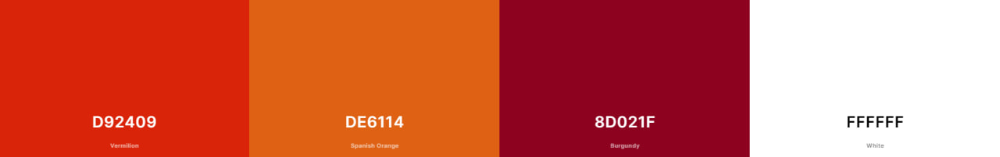

Site is very clean and straight forward so colors been choosef are bright, powerfull and prompt to action

[Table of Contests](#table-of-contests)

## Font

As for fonts I choose Baskerville and Signika. I believe they compliment each other as they bose are strict but soft and suits for project.

[Table of Contests](#table-of-contests)

## Wireframes

##########

[Table of Contests](#table-of-contests)

## Images

#############

[Table of Contests](#table-of-contests)

# Technologies Used

## Languages

- HTML5
- CSS3
- Python
- Django
- SQL
- Javascript

[Table of Contests](#table-of-contests)

## Frameworks, libraries etc.

- [Google Fonts](https://fonts.google.com/) - for font families.
- [Font Awesone](https://fontawesome.com/) - for icons in footer element.
- [Git](https://git-scm.com/) - version control and pushing to store at Github.
- [Github](https://github.com/) - store my repository.
- [Balsamiq](https://balsamiq.com/) - to create wireframes.
- [Google Maps](https://www.google.com/maps) - to show Users where health center is located
- [Bootstrap](https://getbootstrap.com/) - responsive design
- [Unsplash](https://unsplash.com/) - source of image

[Table of Contests](#table-of-contests)

# Features

## Existing Features

### Nav Bar

Navigation bar should be clear and easy to use for all Users. All links that are related to accounts are together so once you log in your menu will change. 
Depends if you are regular user or trainer member. If you are not logged in it is still working but you can't book training. Navigation bar is responsive so after 992px it will collapse

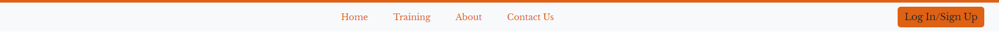

Collapsed nav bar

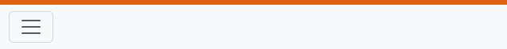

[Table of Contests](#table-of-contests)

### Home

First page. Simple, Clean and easy. People who visit should book training so minimum reading just action

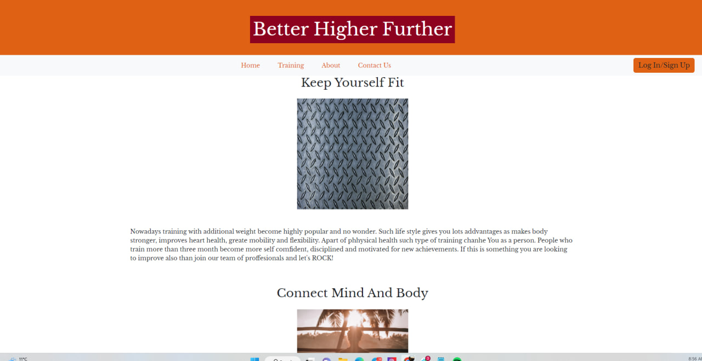

[Table of Contests](#table-of-contests)

### About

Brief explanation of what and why we are doing with some photos to show main domains of our service

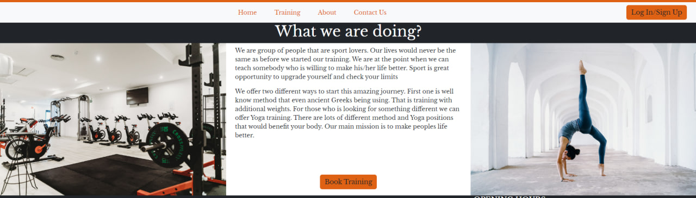

[Table of Contests](#table-of-contests)

### Footer

Footer contains some brief information about company as main information there are hours that health center is opened and information 
how to get in touch like phone, address  and email. Also 4 social media links located there. 

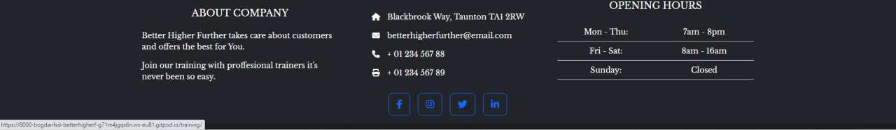

[Table of Contests](#table-of-contests)

### Contact Us

Contact Us page with form for any request and google map which would show where to find us

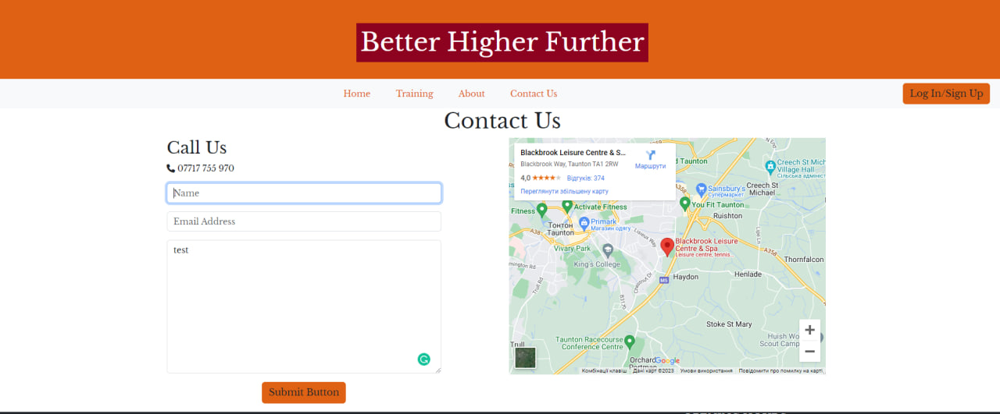

Once user submit form he/she would receive Success alert

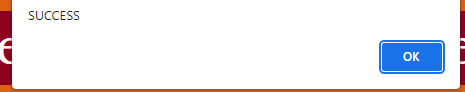

[Table of Contests](#table-of-contests)

### Login Page 

Login page taken from module allauth and some custom stling on top

Once User Loged In he/she would receive message that they did that correct

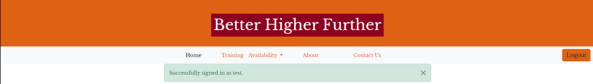

[Table of Contests](#table-of-contests)

### Booking Form

Once user logged in he/she can book trainer, date, time 

And received conformation after booking

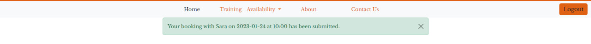

But only if you choose correct date 

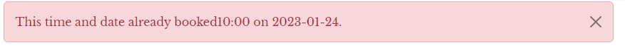

[Table of Contests](#table-of-contests)

### Booked Sessions

After this User can check if he has any bookings there

And if he want to make any changes this is possible by clicking on edit 

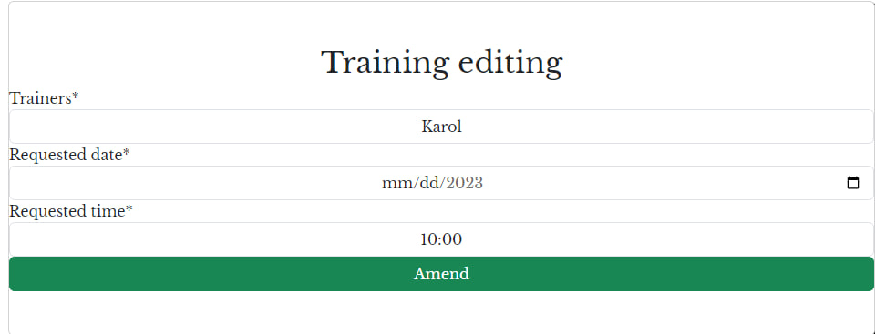

And receive confirmation

But you need to choose date which is free already

And if user don't want to go to training we can delete as well

Also with confirmation 

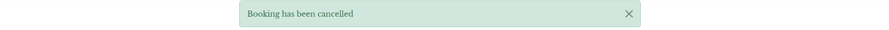

[Table of Contests](#table-of-contests)

## Future Features

1. Updating Trainings during the week.
2. Events posts like hour changing or some new classes to train
3. Gallery
4. Reset Password
5. Social media sign in
6. Beautify alert after user send form
7. Shop for t-shirts etc.
8. Online consultation

# Database

## Database diagram

Below database diagram

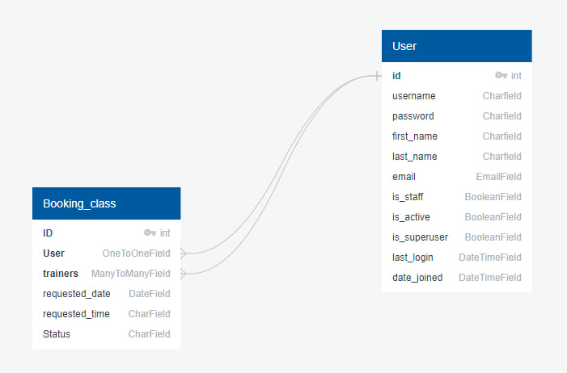

[Table of Contests](#table-of-contests)

# Testing User stories

# Validation

########

[Table of Contests](#table-of-contests)

# Testing

##########

[Table of Contests](#table-of-contests)

# Bugs

##########
s

[Table of Contests](#table-of-contests)

# Deployment

###########

[Table of Contests](#table-of-contests)

# Credit 

########

[Table of Contests](#table-of-contests)

# Acknowledgements

[Table of Contests](#table-of-contests)

