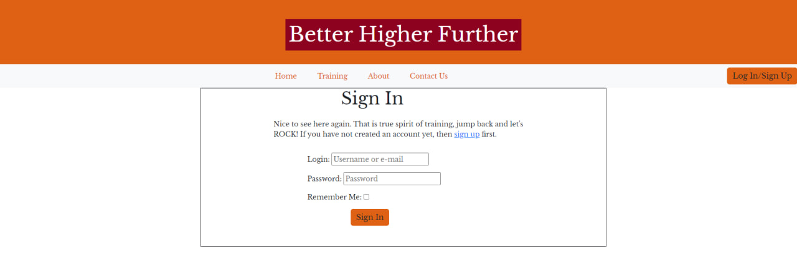
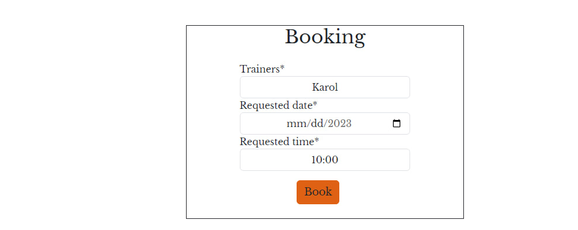
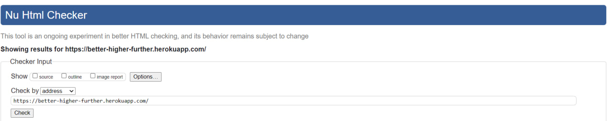

# Better Higher Further

## Description

Better Higher Further is a health center where User can choose between Gym and Yoga training to make health **Better**, life standarts **Higher** and live **Further**. User can choose most suitable day, hour and trainer to book  session with so he/she can controll his training as much as possible. Due to bank holidays or other occasion workiing hours more likely to change so health center will update Users with relevant information.

Live link for "Better Higher Further" [Here](https://better-higher-further.herokuapp.com/)

## Table of Contests

- [UX](#UX)
    - [Project Goals](#project-goals)
    - [Site Owner Goals](#site-owner-goals)
    - [Audience](#audience)
    - [New User Goals](#new-user-goals)
    - [Current User Goals](#current-user-goals)
- [User Stories](#user-stories)
    - [New User Stories](#new-user-stories)
    - [Returning User Stories](#returning-user-stories)
    - [Admin/Staff Stories](#admin-staff-stories)
- [Agile Methodology](#agile-methodology)
    -[GitHub Project Board](#github-project-board)
- [Design](#design)
    - [Colour Scheme](#colour-scheme)
    - [Font](#font)
- [Technologies Used](#technologies-used)
    - [Languages](#languages)
    - [Frameworks, libraries etc.](#frameworks-libraries-etc.)
- [Features](#features)
    - [Existing Features](#existing-features)
    - [Future Features](#future-features)
- [Testing User Stories](#testing-user-stories)
- [Database](#database)
- [Validation](#validation)
- [Testing](#testing)
- [Bugs](#bugs)
- [Deployment](#deployment)
- [Credit](#credit)
- [Acknowledgements](#acknowledgements)

# UX

## Audience

For people of all ages and genders to make their physical health better in the best way.

## Project Goals

1. User can register account in the website.
2. User can log in his account and book session.
3. User can edit or delete his/her training.
4. User can see which and chen training is available

## Site Owner Goals

1. To create, delete or edit new sessions.
2. To approve trainings.

## New User Goals

1. Choose what type of training is better for them.
2. Understand what is the benefit of each type of training.
3. Book session of training.

## Current User Goals

1. Login and logout to account.
2. See booked seesoins if any.
3. Ability to create, delete or edit session
4. Ability to see when is which training

# User Stories

## New User Stories

1. As a **User** I can **easily create my account** so that **start using service of the heath center**.
2. As a **User** I can **see what training are available** so that **I can easely choose**.
3. As a **User** I can **find easely contact form or phone number** so that **I can get in contact immediately**
4. As a **User** I can **find links to the gyms in social media** so that **I can connect**

## Returning User Stories

1. As a **Returning User** I can **log in and book another training** so that **I want to keep going with training**.
2. As a **Returning User** I can **log in and edit my booking session** so that **I can update my trainer** .
3. As a **Returning User** I can **log in and delete my session** so that **I can update my trainer**.

## Admin Stories

1. As a **Admin** I can **see how many Users is registered** so that **I see how amount of clients decreasing or increasing**.
2. As a **Admin** I can **see how many bookings are in progress** so that **I check if they all are appropriately booked**.
3. As a **Admin** I can **create new bookings and users** so that **I can help my customers**.

# Agile Methodology

## GitHub Project Board

With this Project I used project boards offered by Github. They are unusual at the beggining but but make sense with time. I can break big Tasks
into smaller one and moving to my goal step my step. Always keeping track of it. No need to think many hours what you should do.

# Design

## Colour Scheme

Site is very clean and straight forward so colors been choosef are bright, powerfull and prompt to action

[Table of Contests](#table-of-contests)

## Font

As for fonts I choose Baskerville and Signika. I believe they compliment each other as they bose are strict but soft and suits for project.

[Table of Contests](#table-of-contests)

[Table of Contests](#table-of-contests)

# Technologies Used

## Languages

- HTML5
- CSS3
- Python
- Django
- SQL
- Javascript

[Table of Contests](#table-of-contests)

## Frameworks, libraries etc.

- [Google Fonts](https://fonts.google.com/) - for font families.
- [Font Awesone](https://fontawesome.com/) - for icons in footer element.
- [Git](https://git-scm.com/) - version control and pushing to store at Github.
- [Github](https://github.com/) - store my repository.
- [Balsamiq](https://balsamiq.com/) - to create wireframes.
- [Google Maps](https://www.google.com/maps) - to show Users where health center is located
- [Bootstrap](https://getbootstrap.com/) - responsive design
- [Unsplash](https://unsplash.com/) - source of image

[Table of Contests](#table-of-contests)

# Features

## Existing Features

### Nav Bar

Navigation bar should be clear and easy to use for all Users. All links that are related to accounts are together so once you log in your menu will change. 
Depends if you are regular user or trainer member. If you are not logged in it is still working but you can't book training. Navigation bar is responsive so after 992px it will collapse

Collapsed nav bar

[Table of Contests](#table-of-contests)

### Home

First page. Simple, Clean and easy. People who visit should book training so minimum reading just action

[Table of Contests](#table-of-contests)

### About

Brief explanation of what and why we are doing with some photos to show main domains of our service

[Table of Contests](#table-of-contests)

### Footer

Footer contains some brief information about company as main information there are hours that health center is opened and information 
how to get in touch like phone, address  and email. Also 4 social media links located there. 

[Table of Contests](#table-of-contests)

### Contact Us

Contact Us page with form for any request and google map which would show where to find us

Once user submit form he/she would receive Success alert

[Table of Contests](#table-of-contests)

### Login Page 

Login page taken from module allauth and some custom stling on top

Once User Loged In he/she would receive message that they did that correct

[Table of Contests](#table-of-contests)

### Booking Form

Once user logged in he/she can book trainer, date, time 

And received conformation after booking

But only if you choose correct date 

[Table of Contests](#table-of-contests)

### Booked Sessions

After this User can check if he has any bookings there

And if he want to make any changes this is possible by clicking on edit 

And receive confirmation

But you need to choose date which is free already

And if user don't want to go to training we can delete as well

Also with confirmation 

[Table of Contests](#table-of-contests)

## Future Features

1. Updating Trainings during the week.
2. Events posts like hour changing or some new classes to train
3. Gallery
4. Reset Password
5. Social media sign in
6. Beautify alert after user send form
7. Shop for t-shirts etc.
8. Online consultation

# Database

## Database diagram

Below database diagram

[Table of Contests](#table-of-contests)

# Testing User stories

## 1. As a **User** I can **easily create my account** so that **start using service of the heath center**

|Feature|Action|Expected Result|Actual Result|
|---|---|---|---| 
|At navbar|Click on Log In/Sign Up button| Redirect to Log In page and once logged in receive conformation| As Expected

confirmation 

## 2. As a **User** I can **see what training are available** so that **I can easely choose**.

|Feature|Action|Expected Result|Actual Result|
|---|---|---|---| 
|At navbar|Click on Trainings| Redirect to page with available trainings| As Expected

## 3. As a **User** I can **find easely contact form or phone number** so that **I can get in contact immediately**
|Feature|Action|Expected Result|Actual Result|
|---|---|---|---|
|At navbar|Click on Contact Us | Redirect to page with Contact Us form and phone number on top, also user can find relevant information in at the footer| As Expected

## 4. As a **User** I can **find links to the gyms in social media** so that **I can connect**
|Feature|Action|Expected Result|Actual Result|
|---|---|---|---|
|At footer click on links|Go down till you would see 4 blue buttons that will redirect you to social media page | Once clicked you are redirected| As Expected

## 5. As a **Returning User** I can **log in and book another training** so that **I want to keep going with training**
|Feature|Action|Expected Result|Actual Result|
|---|---|---|---|
|Book training|log In, click Book, choose date and trainer, submit | Booked and received conformation| As Expected

## Browser Testin

Websire tested on:
- Mozilla Firefox
- Google Chrome (desktop and mobile version)
- Microsoft Edge
- Safari for iOS

[Table of Contests](#table-of-contests)

## Manual Testing

Testing been done on website manually like inputs, cliking links, edit and deleting form.

- Alert messages showes correctly
- Link are clickable
- if you want to check some pages while you are not logged in wou will be redirected to home
- CRUD functionality working ptoperly
- Conformation messages appear appropriately

[Table of Contests](#table-of-contests)

# Validation

## HTML Validation

[W3c  Validation ](https://validator.w3.org/) Been used for code validation, all pages passed

Home

About

Training

Booking

Booked

## CSS Validation

[W3c CSS ](https://jigsaw.w3.org/css-validator/) Once appear to me 15 errors but due to bootstrap, unfortunately I didn't catch it

CSS

## JS Validation

[JSHint](https://jshint.com) Used for validation of Javascript code. Received 0 errors

Javascript

## PEP8

[PEP8](http://pep8online.com) validate my code

[Table of Contests](#table-of-contests)

# Bugs

- Bug: Initial Deployment django engine throw me an error.
- Fix: My DATABASE_URL contained <> on sides which caused the issue
- Bug: Form was not rendering to edit view but loaded for booking
- Fix: When I defined {'form-1':form-2} I put form 2 instead
- Bug: Booking didn't saved 
- Fix: I created instance without request.Post 
- Bug: On deployment 400 error
- Fix: Fixed typo in ALLOWED_HOSTS

[Table of Contests](#table-of-contests)

# Deployment

1. Create account on Heroku
2. Click on the button in upper right corner and choose new app
3. Select region and create app
4. Sign Up in ElephantSQL to allow instantiation databases choose "Trynow for free"
5. Connect your Github
6. Create new Team and you account created
7. Create new instance with plan of Tiny Turtle
8. Select any data center
9. Click review and create instance
10. Click on your app name and then copy URL
11. Create env.py file and store there some variables of URL you copied and secret_key 
12. In settings.py modify databases with variable for URL you just created
13. Run python manage.py migrate for migrations
14. Go back to Heroku settings and put config vars. Your databa_url and secret_key
15. While creating (!ONLY) set Debug = True once you would deploy completely set debug to false again
Application deployed on [Heroku](https://dashboard.heroku.com/)

before final deployment is important to create env.py and store there all sensetive information the you don't want other people had acccess 

[Table of Contests](#table-of-contests)

# Credit 

Date picker found on Solution found at: https://webpedia.net/how-to-use-datepicker-in-django
Bootstrap created my responsive design
Stackoverflow for answer on any questions
[SimpleIsBetterThanComplex](https://simpleisbetterthancomplex.com/) a lot of good articles about django

[Table of Contests](#table-of-contests)

# Acknowledgements

Rohit Sharma person who can fix everything in less than 5 min and create entirelly new logic in couple seconds.
Slack Community
Code Institute support

[Table of Contests](#table-of-contests)

